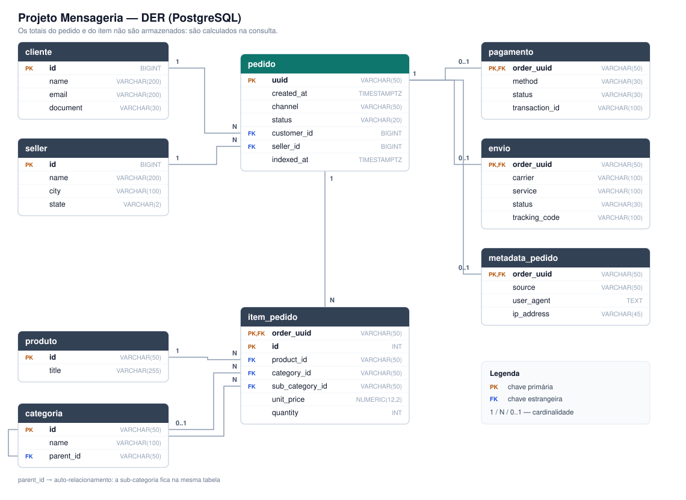
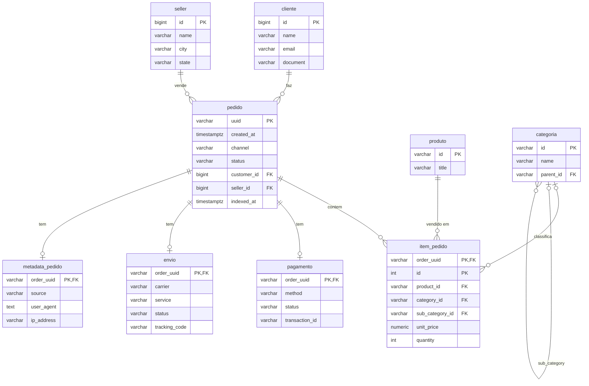

# Projeto Mensageria — Pedidos (C# / .NET 8 + Google Pub/Sub + PostgreSQL)
Disciplina: Computação em Nuvem 2 Curso: Desenvolvimento de Software Multiplataforma (DSM) - FATEC Membros da Equipe:
Gustavo Schizari


Um consumidor lê pedidos de um sistema de vendas de marketplace publicados no **Google Pub/Sub**, persiste tudo em um banco relacional (**PostgreSQL**) e uma **API REST** permite consultar os pedidos.


```
 Publisher (demo) ──► [ Pub/Sub: tópico "pedidos" ] ──► Pedidos.Consumer ──► PostgreSQL ◄── Pedidos.Api ◄── HTTP
```

## Estrutura

| Pasta | Conteúdo |
|---|---|
| `src/Pedidos.Shared` | Contrato do payload, entidades, `DbContext` (EF Core), JSON snake_case, setup do Pub/Sub |
| `src/Pedidos.Consumer` | Worker que assina o Pub/Sub, valida e grava os pedidos (idempotente) |
| `src/Pedidos.Api` | API REST (ASP.NET Core) com Swagger |
| `src/Pedidos.Publisher` | Ferramenta para publicar pedidos na fila durante a demonstração |
| `database/schema.sql` | Script do banco (DER) |
| `samples/pedido-exemplo.json` | Payload de exemplo do enunciado |

## Como rodar

Pré-requisitos: Docker e .NET 8 SDK.

```bash
# 1. Sobe banco, emulador do Pub/Sub, consumidor e API
docker compose up --build

# 2. Em outro terminal, publica pedidos na fila
dotnet run --project src/Pedidos.Publisher -- --file samples/pedido-exemplo.json
dotnet run --project src/Pedidos.Publisher -- 100        # 100 pedidos aleatórios

# 3. Consulta a API
#    Swagger: http://localhost:5000/swagger
curl "http://localhost:5000/orders?customer.id=7788"
```

Para rodar a API e o consumidor fora do Docker (debug no Visual Studio / Rider), suba só a infraestrutura com `docker compose up postgres pubsub` e rode `dotnet run --project src/Pedidos.Consumer` e `dotnet run --project src/Pedidos.Api`. Os `appsettings.json` já apontam para `localhost`.

## Modelo de dados (DER)



Gerado a partir de [`database/schema.sql`](database/schema.sql), que é a fonte da verdade do
esquema — o projeto não usa migrations do EF Core.

<details>
<summary>Mesmo diagrama em Mermaid (renderizado pelo GitHub)</summary>



</details>

## Endpoints

Todas as respostas usam a mesma estrutura (snake_case) do payload, e os campos `total` são calculados na hora da consulta.

### `GET /orders`

| Parâmetro | Exemplo | Descrição |
|---|---|---|
| `customer.id` | `7788` | id do cliente |
| `product.id` | `abc-1344` | pedidos que contêm o produto |
| `status` | `shipped` | status do pedido |
| `seller.id` | `55` | id do seller |
| `page` | `1` | página (começa em 1) |
| `page_size` | `20` | itens por página (máx. 100) |
| `order` | `desc` | ordenação por `created_at`: `asc` ou `desc` |

```json
{
  "data": [ { "uuid": "ORD-2025-0001", "...": "..." } ],
  "page": 1,
  "page_size": 20,
  "total_items": 1,
  "total_pages": 1
}
```

### `GET /orders/{uuid}`
Pedido completo, no formato do payload. Retorna 404 se não existir.

### `GET /orders/{uuid}/items`
Apenas a estrutura de items do pedido: `{ "items": [ ... ] }`.

### `GET /orders/financial-summary`

| Parâmetro | Exemplo |
|---|---|
| `seller.id` | `55` |
| `start_date` | `2025-10-01` ou `2025-10-01T00:00:00Z` |
| `end_date` | `2025-10-31` (dia inteiro incluído) |

```json
{
  "total_orders": 150,
  "total_revenue": 750000.00,
  "average_order_value": 5000.00,
  "by_status": { "created": 10, "paid": 120, "shipped": 15, "delivered": 5, "canceled": 0 },
  "by_payment_method": {
    "pix": { "count": 80, "total": 400000.00 },
    "credit_card": { "count": 50, "total": 250000.00 },
    "boleto": { "count": 20, "total": 100000.00 }
  }
}
```

## Decisões de projeto

**Totais calculados dinamicamente.** `total` do item (`unit_price * quantity`) e do pedido (soma dos itens) não são gravados. Se vierem na mensagem, são ignorados.

**Hora de indexação.** A coluna `pedido.indexed_at` guarda o momento em que o consumidor gravou a mensagem.

**Idempotência.** O Pub/Sub entrega cada mensagem *pelo menos uma vez*, então o consumidor faz upsert pelo `uuid`: reprocessar a mesma mensagem atualiza o pedido em vez de duplicá-lo. Cliente, seller, produto e categoria também usam upsert.

**Ack/Nack.** Mensagens com JSON inválido ou dados obrigatórios faltando são registradas no log e confirmadas (Ack), pois reenviá-las nunca daria certo. Em produção, o ideal é uma *dead-letter topic*. Erros transitórios, como banco fora do ar, geram Nack e o Pub/Sub reentrega a mensagem.

**Status.** Seguimos os status das Considerações (`created, paid, shipped, delivered, canceled`). O payload de exemplo do enunciado usa `"separated"`, que não está nessa lista. O consumidor aceita o valor, mas registra um aviso. No `samples/pedido-exemplo.json` usamos `shipped`. No `by_status` do financial-summary usamos esses mesmos status do pedido, e não os de pagamento (`pending`/`approved`) que aparecem no exemplo do enunciado.

**Receita.** `total_revenue` considera todos os pedidos do filtro, inclusive cancelados, igual ao exemplo do enunciado, em que a soma de `by_status` bate com `total_orders`.

**Categoria.** No payload a categoria vem no item, então `item_pedido` guarda `category_id` e `sub_category_id`. As duas apontam para a tabela `categoria`, que tem auto-relacionamento.

**Rotas.** No ASP.NET Core, segmentos literais têm prioridade sobre parâmetros, então `/orders/financial-summary` nunca é confundido com `/orders/{uuid}`.

## Entregáveis

- [ ] Demonstração do projeto funcionando (roteiro: `docker compose up`, publicar pedidos, mostrar logs do consumidor, chamar os endpoints no Swagger)
- [ ] DER do banco de dados (seção acima / `database/schema.sql`)
- [ ] Fontes do projeto no Git
- [ ] Commits de **todos** os membros do grupo
